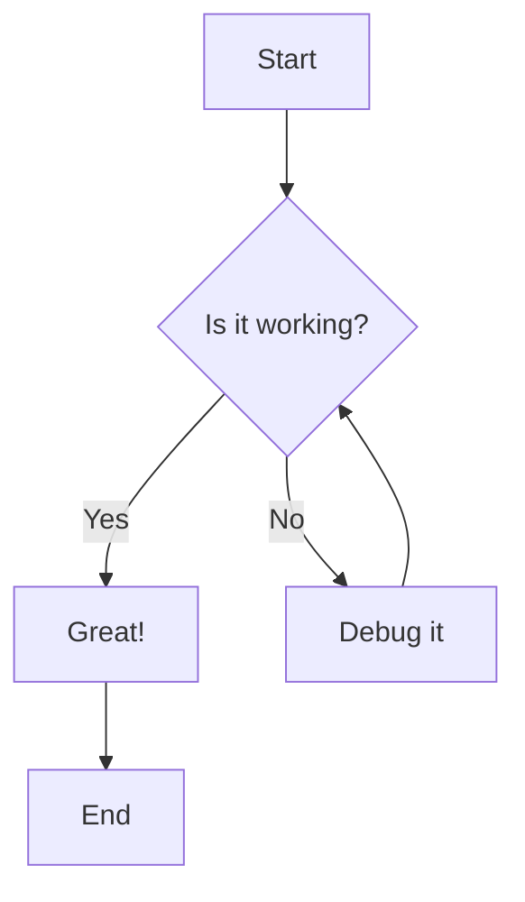
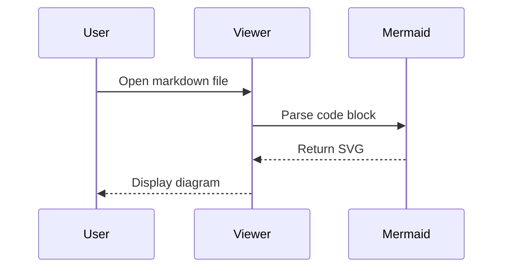
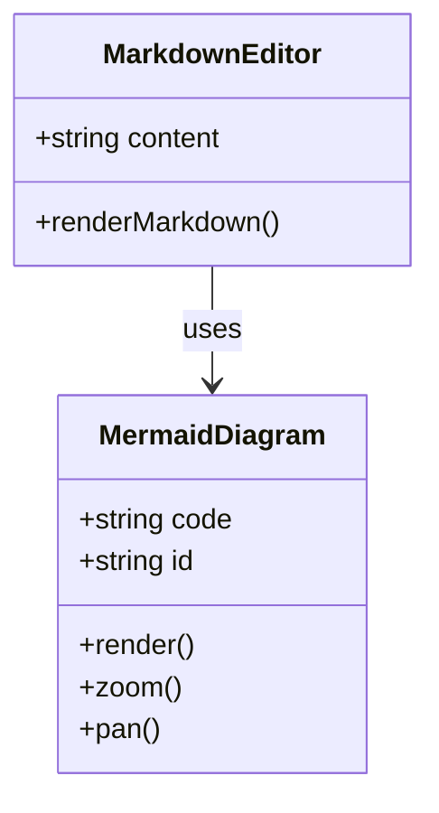
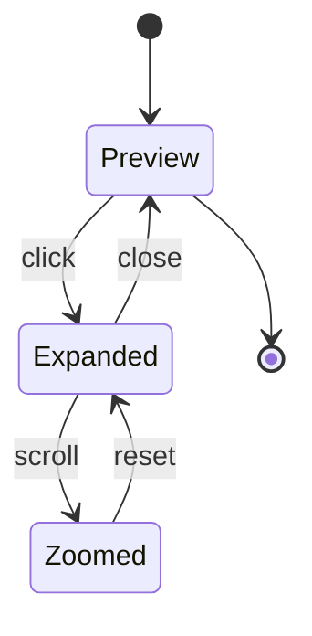

# Mermaid Diagram Test

This markdown file contains embedded mermaid diagrams to test the new rendering feature.

## Flowchart



## Sequence Diagram



## Class Diagram



## Regular Code Block (should still work)

```typescript
function hello() {
    console.log("This is NOT a mermaid diagram");
}
```

## State Diagram



Done! Click any diagram to expand it with zoom/pan controls.
